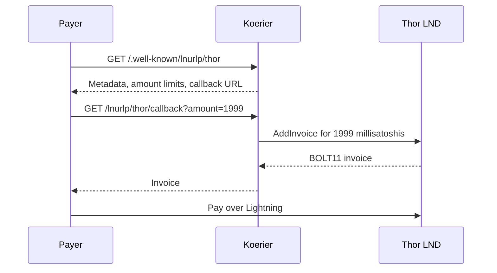

# koerier

A small Rust service that gives multiple LND nodes Lightning Addresses on one HTTPS domain.
This fork extends [luisschwab/koerier](https://github.com/luisschwab/koerier) with explicit node routing and bounded invoice requests.
The original MIT OR Apache-2.0 licenses remain in effect.

| Lightning Address | LND REST endpoint |
| --- | --- |
| `odin@ln.example.org` | `127.0.0.1:8080` |
| `thor@ln.example.org` | `127.0.0.1:8081` |
| `freya@ln.example.org` | `127.0.0.1:8082` |

Each configured name maps to one LND node. Unknown names return an error.
The service creates invoices; payments travel over Lightning directly to the selected node.
It needs an invoice macaroon and TLS certificate for each node, with no wallet database or payment-sending credentials.



## Run

Install Rust 1.95 or later, `pkg-config`, and the OpenSSL development headers and libraries.
For Nix users, `nix develop` provides these build dependencies.

Build with the committed dependency lock:

```sh
cargo build --release --locked
cp example/config.toml.example config.toml
```

Edit `config.toml` with your public HTTPS origin, node endpoints, and credential paths.
Then start the service:

```sh
./target/release/koerier --config config.toml
```

Relative credential paths resolve beneath `CREDENTIALS_DIRECTORY` when systemd provides it.
Otherwise, they resolve beside the configuration file. Absolute paths also work.
Use the binary `invoice.macaroon`, not its hex encoding.
The node certificate must cover the IP address in `rest_host`.

The example listens on `127.0.0.1:8090`. Put Caddy or another HTTPS reverse proxy in front of it.
See [the Caddy example](example/Caddyfile.example) and [the systemd example](example/koerier.service.example).
Serve discovery and callback paths publicly; keep `/healthz` private.
If the proxy runs on another host, bind the private interface and allow only that proxy through the firewall.

## Configuration

The `[koerier]` section configures the shared listener and HTTPS origin.
Use one `[nodes.<name>]` section per LND node, as shown in [the complete example](example/config.toml.example).

| Setting | Meaning |
| --- | --- |
| `domain` | Public HTTPS origin used to construct callbacks; request Host headers do not change it |
| `bind_address` | Private HTTP listener |
| `request_timeout_secs` | Deadline for each LND request; defaults to 10 seconds |
| `max_in_flight` | Maximum simultaneous invoice requests; defaults to 16 |
| `min_invoice_amount`, `max_invoice_amount` | Per-node advertised amount bounds, configured in satoshis |
| `invoice_expiry_sec` | Per-node invoice lifetime |

Discovery and callback amounts use millisatoshis. A 1,999-msat request creates a 1,999-msat invoice without rounding.
Invoices include private-channel route hints and a description hash of the exact advertised metadata.
Node requests verify TLS, disable redirects and proxies, reuse connections, and return bounded errors when LND is unavailable.
On Linux, the native TLS backend uses OpenSSL and trusts only the certificate configured for that node.
It verifies certificate validity and the requested IP address, including LND's self-signed certificates with `CA:true`.
The service uses the configured LND node's Bitcoin network, including Mutinynet signet.
Verify each backend's network and channels before paying; koerier does not independently verify the returned BOLT11 invoice.

This fork replaces upstream's single `[lnd]` section with `[nodes.<name>]` sections.
Callbacks now include the configured node name: `/lnurlp/<name>/callback`.

## NixOS

The flake exports packages for `x86_64-linux` and `aarch64-linux`, plus `nixosModules.default`.
See [the NixOS module](nix/module.nix) for its options.
Credentials remain host files and are passed through systemd `LoadCredential`.
The module does not open a public firewall port or configure DNS/TLS.

```sh
nix build .#koerier
nix flake check
```

## Verify

Fetch discovery, then request a small invoice:

```sh
curl --fail https://ln.example.org/.well-known/lnurlp/thor
curl --fail 'https://ln.example.org/lnurlp/thor/callback?amount=1999'
```

Discovery returns `tag: payRequest` and a callback for Thor.
The callback returns `pr`, containing an invoice for exactly 1,999 msat.
Pay it from a different node and confirm receipt on Thor. Repeat for Freya.
Creating an invoice alone does not verify payment routing or receipt.

`GET /healthz` reports process liveness, not LND synchronization or channel liquidity.
Restart koerier after replacing node certificates or macaroons; it loads credentials at startup.

Run the focused protocol and backend checks locally:

```sh
cargo fmt --all --check
cargo test --locked
cargo clippy --all-targets --locked -- -D warnings
```

This service implements ordinary [LNURL-pay](https://github.com/lnurl/luds/blob/luds/06.md)
and [Lightning Addresses](https://github.com/lnurl/luds/blob/luds/16.md).
It does not create hold invoices tied to a caller-provided payment hash.
